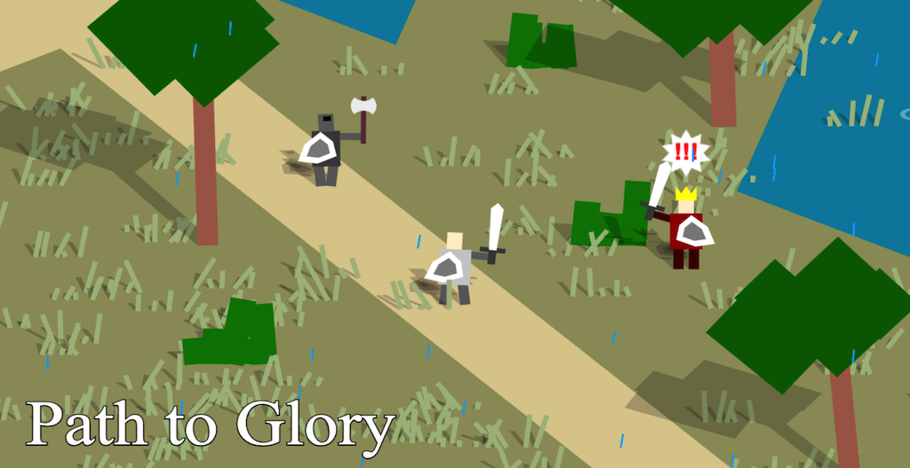

# Knight.JS

from @Rainbow Coding Lab

- 2023/10/28

KnightJS Game Engine migrated from [knight](https://github.com/remvst/knight)

## Why doing this

Original version of knight game developed and built with a non-modules approach, it works but looks not well organized.
In order to make it running with a modern javascript native module way, and do not need to rely on a build tool to make it executable in browser, I migrated and refactored the whole project into a `module`lized javascript project. 

With this refactoring work, this project have a clear structure starting with an index file, so its easy to read, maintain, and extend than ever.


## Features

One big change compared with original is the game `level` initialization, this modulized version change the way of level initial, using a `Level Manager` to coordinate level change. So that, there would be no more circualr reference inside the project. 


## Development

```
npm install
npm start
```

then open browser to visit: http://localhost:3000


## Verson History

- v1.0 - 2023/10/28 ceate project structure
- v1.1 - 2023/11/08 project is working with bug, no player showing up
- v1.2 - 2023/11/10 project is fully working without bugs, and CPU usage under 100%